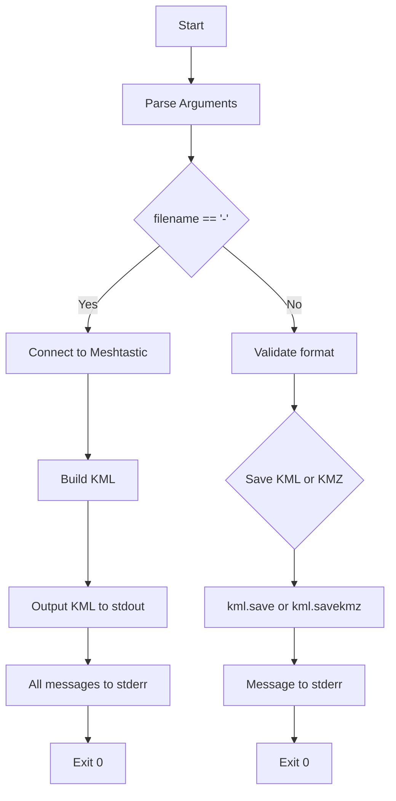

# Implementation Plan: stdout KML and stderr Messaging

## Objective
Modify `src/main.py` so that:
1. Default behavior (without arguments) writes KML content to **stdout**
2. All status/debug messages go to **stderr**

## Current Behavior Analysis
The current `src/main.py`:
- Defaults to saving `nodedb.kml` file when no `--filename` is provided
- All `print()` statements output to stdout
- Uses `kml.save()` for KML files and `kml.savekmz()` for KMZ files

## Proposed Changes

### 1. Add `sys` import for stderr access
```python
import sys
```

### 2. Modify argument parser
Change the default filename to `-` (dash) to indicate stdout:
```python
parser.add_argument('-f', '--filename',
    required=False,
    default='-',  # Changed from 'nodedb.kml'
    help='filename to export, use - for stdout',
)
```

### 3. Update all print statements to use stderr
Replace all `print()` calls with `print(..., file=sys.stderr)`:
- Line 39: `print('Connected')`
- Line 49: `print(f'Skip\t{nodeid}...')`
- Line 53: `print(f'Add\t{nodeid}...')`
- Line 59: `print('Node list processed')`
- Line 60: `print(f'Added {count}/...')`
- Line 64: `print(f'Saved kml to {args.filename}')`
- Line 68: `print(f'Saved kmz to {args.filename}')`

### 4. Handle stdout output for KML
Add logic to output KML to stdout when filename is `-`:
```python
if args.filename == '-':
    # Output to stdout
    print(kml.kml(), end='')  # kml.kml() returns the KML as a string
    exit(0)
```

### 5. Update file saving logic
Keep existing file saving logic for when a filename is provided:
```python
if args.format == 'kml':
    kml.save(args.filename)
    print(f'Saved kml to {args.filename}', file=sys.stderr)
    exit(0)
if args.format == 'kmz':
    kml.savekmz(args.filename)
    print(f'Saved kmz to {args.filename}', file=sys.stderr)
    exit(0)
```

## Usage Examples

### Default (stdout KML, stderr messages):
```bash
meshtastic-kml-kmz-exporter > output.kml
```

### With explicit filename:
```bash
meshtastic-kml-kmz-exporter -f output.kml
```

### With KMZ:
```bash
meshtastic-kml-kmz-exporter -f output.kmz
```

## Mermaid Flowchart: New Program Flow



## Files to Modify
- `src/main.py` - Main implementation file

## Testing Checklist
- [ ] Default run outputs KML to stdout and messages to stderr
- [ ] `-f filename.kml` saves to file with messages to stderr
- [ ] `-f filename.kmz` saves to KMZ with messages to stderr
- [ ] Verbose mode messages go to stderr
- [ ] Error messages go to stderr